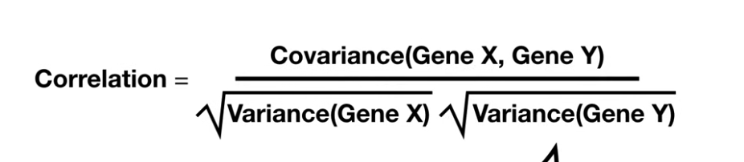

## Mean vs Median

- Mean is affected significantly by the outliers
- Median is slightly affected by the outliers
- Example: average salary in a company with one
  CEO earning 10 crore looks high
  Median salary tells the real story

## Standard deviation

- It tells about the spread of the values around the mean.
- The greater is its value, the more spread the data is around the mean

## Percentiles

- p50 - Exactly 50% of the values lie above and below this value
- p95 - Exactly 95% of the values lie below this value.
- p99 - used for latency, outlier detection
- Example: if p95 delivery time = 45 minutes,
  95% of deliveries happen within 45 minutes

## Hypothesis Testing

- Null Hypothesis (H0): changes made have no effect
- Alternative Hypothesis (H1): changes made were effective
- In this testing, H0 (Null Hypothesis) is tried to be disproved; H1 (Alternative Hypothesis) is not tried to be proved

## p-value

- it tells what is the probability of changes having no effect.
- The smaller is its value, the less are the chances of null hypothesis being true
- p <= 0.05 then the results are statistically significant
- Remember that it does not tell that how big is the effect due to change and is it worth considering or not

## Type-1 Error: (False Positive) (False Alarm)

- You concluded that the change has an effect (alarm rung) but in actual there was no effect due to the change (in actual no alarm rang)
- Example: launching a feature that actually does not improve conversion

## Type-2 Error: (False Negative) (Missed Alarm)

- You found out that the change has no effect (alarm did not ring) while in actual there was an effect (alarm rang in actual)
- Example: killing a feature that would have helped

## Sample Size

- If the sample size is not big enough, the results cannot be trusted
- run the test (for collecting data) till the sample size is big enough
- Never stop a test too early if it looks good.
- This is called "Peeking." If you check the p-value every hour and stop as soon as it hits $0.05$, you are significantly increasing your Type-1 Error (False Positive) rate. You must wait until the pre-calculated Sample Size is reached.

## Minimum Detectable Effect (MDE)

- the smallest improvement that is "actually worth" for a business to take care of
- Example: If launching a new checkout button costs $100k in engineering time, a $0.1\%$ increase in conversion might be "statistically significant" ($p \le 0.05$) but it isn't practically significant because it doesn't cover the cost.

## Revision Table

Concept,Simple Definition,Business Stakeholder Version
Confidence Interval,"The range where the ""true"" effect likely sits.","""We are 95% sure the conversion increase is between 2% and 4%."""
MDE,"The ""threshold of caring.""","""Unless this change brings at least a 1% lift, it’s not worth the dev effort."""
Effect Size,The magnitude of the change.,"""The change was real, but it only moved the needle by a tiny amount."""

| Concept             | Simple Definition                              | Business Stakeholder Version                                                   |
| ------------------- | ---------------------------------------------- | ------------------------------------------------------------------------------ |
| Confidence Interval | The range where the "true" effect likely sits. | "We are 95% sure the conversion increase is between 2% and 4%."                |
| MDE                 | The "threshold of caring."                     | "Unless this change brings at least a 1% lift, it’s not worth the dev effort." |
| Effect Size         | The magnitude of the change.                   | "The change was real, but it only moved the needle by a tiny amount."          |

> In an interview, if they ask: "What happens to the P-value if we increase the sample size but keep the absolute number of conversions the same?"

> The Answer: "The P-value will increase (become less significant) because the effect size (the conversion rate) is actually shrinking as the denominator grows."

## Sample Size in A/B Testing

Variance: It tells us how much the overall data is spread out
Standard Deviation : It tells how much each individual value deviates from the average value of the complete set.

Too small sample = high variance = misleading results

Example:
10 users, 2 converted = 20%
10 users, 3 converted = 30%
That 10% difference means nothing — flip a coin 10 times,
you get wildly different results each time.

10,000 users, 2000 converted = 20%
10,000 users, 3000 converted = 30%
NOW the difference is meaningful.
Minimum Detectable Effect (MDE):
The smallest improvement worth detecting.
If your baseline is 5% and you only care about
improvements above 1% absolute — that is your MDE.

Python for sample size calculation:

```python
from statsmodels.stats.power import NormalIndPower

analysis = NormalIndPower()
n = analysis.solve_power(
    effect_size=0.2,  # small effect
    power=0.8,        # 80% chance of detecting real effect
    alpha=0.05        # 5% false positive rate
)
print(f"Sample size needed per group: {n:.0f}")
```

effect size - how much change you are expecting to see
power - it tells that if there is a real difference than what is the probability that you will successfully detect the change
alpha - this gives the tolerance, that is if probability of not detecting a change is below this value that you are fine with it.

## Correlation

> Pearson Correlation

- It measures how closely two variables are linearly related.
- It indicates how well one variable can be predicted from another (only for linear relationships).
- It does not imply causation. A high correlation only means both variables move together; an external factor may be driving both.
- The value of correlation ranges from -1 to +1.
- Correlation = +1 or -1 means a perfect linear relationship, i.e., all data points lie exactly on a straight line (y = mx + c or y = -mx + c).
- The closer the value is to ±1, the stronger the linear relationship.
- Correlation = 0 means no linear relationship; however, a non-linear relationship may still exist.
- A smaller p-value indicates that the observed correlation is statistically significant and unlikely due to random chance.
- Correlation is sensitive to outliers, which can distort the value significantly.
- A sufficient amount of data is required to have confidence in the correlation value.
- Pearson correlation only captures linear relationships and may fail for curved or complex patterns.



> Important Edge Cases / Limitations:

- Non-linear relationships: Correlation can be close to 0 even when a strong relationship exists (e.g., quadratic patterns).
- Outliers: A few extreme values can significantly increase or decrease correlation.
- Range restriction: Limited variation in data can reduce observed correlation.
- Correlation does not indicate direction of causality.

> Next Steps:

- What is covariance and how is it calculated?
- What is R-squared and how is it related to correlation?

## Correlation does not imply causation

> Suicides

- Correlation - Men have higher suicide rates than women
- Causation - Social norms, behavioral patterns, and the use of more lethal methods explain the difference, not gender itself
- Confounding Factor - Men tend to use more lethal methods, which reduces survival chances

> Breakfast & Family Dinners

- Correlation - Eating breakfast is linked to weight loss; family dinners are linked to lower drug use among children
- Causation - People who eat breakfast often follow healthier lifestyles; families with strong relationships are more likely to dine together
- Confounding Factor - Breakfast eaters may exercise more and maintain better routines; strong family bonding and communication reduce drug use, not the dinner itself

> Hormone Therapy and Heart Disease

- Correlation - Women undergoing hormone therapy show lower risk of heart disease
- Causation - Healthier lifestyle choices (diet, exercise) contribute more to reduced risk than therapy alone
- Confounding Factor - Women on hormone therapy are often more health-conscious and proactive about their well-being

## Additional Concepts (Important for Interviews)

> Spurious Correlation

- Definition - Two variables appear correlated but have no real relationship
- Example - Ice cream sales and drowning cases increase together
- Reason - A hidden variable (summer/temperature) drives both
- Insight - Always check for hidden variables before drawing conclusions

> Simpson’s Paradox

- Definition - A trend observed in overall data reverses when data is split into groups
- Example - A product seems better overall, but worse in every individual region
- Insight - Aggregated data can be misleading; always analyze segmented data

> Confounding Variable (General Form)

- A third variable (Z) affects both X and Y, creating a misleading relationship
- Structure:
  - Z → X
  - Z → Y
- Insight - Proper analysis requires identifying and controlling confounders

> Key Takeaway

- Correlation is a starting point, not a conclusion
- Always validate with domain knowledge, segmentation, and visualization before making decisions
